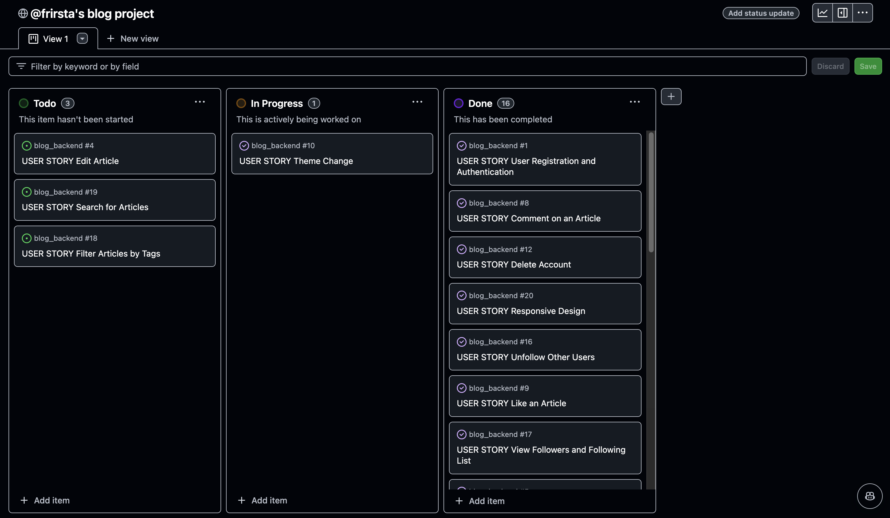
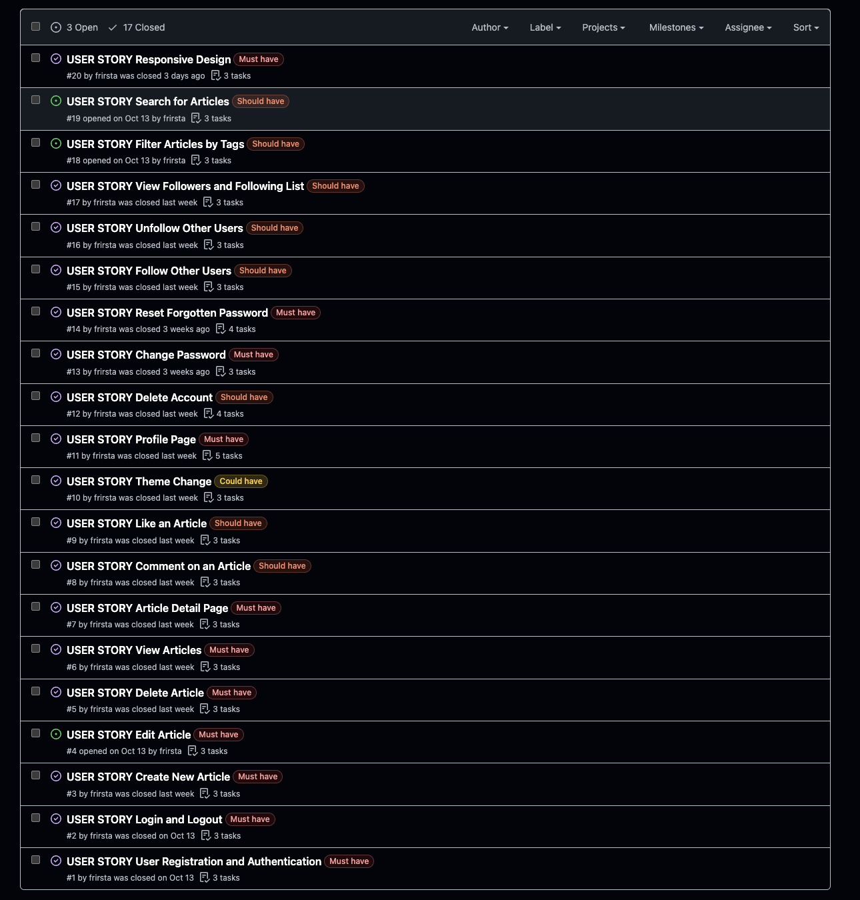
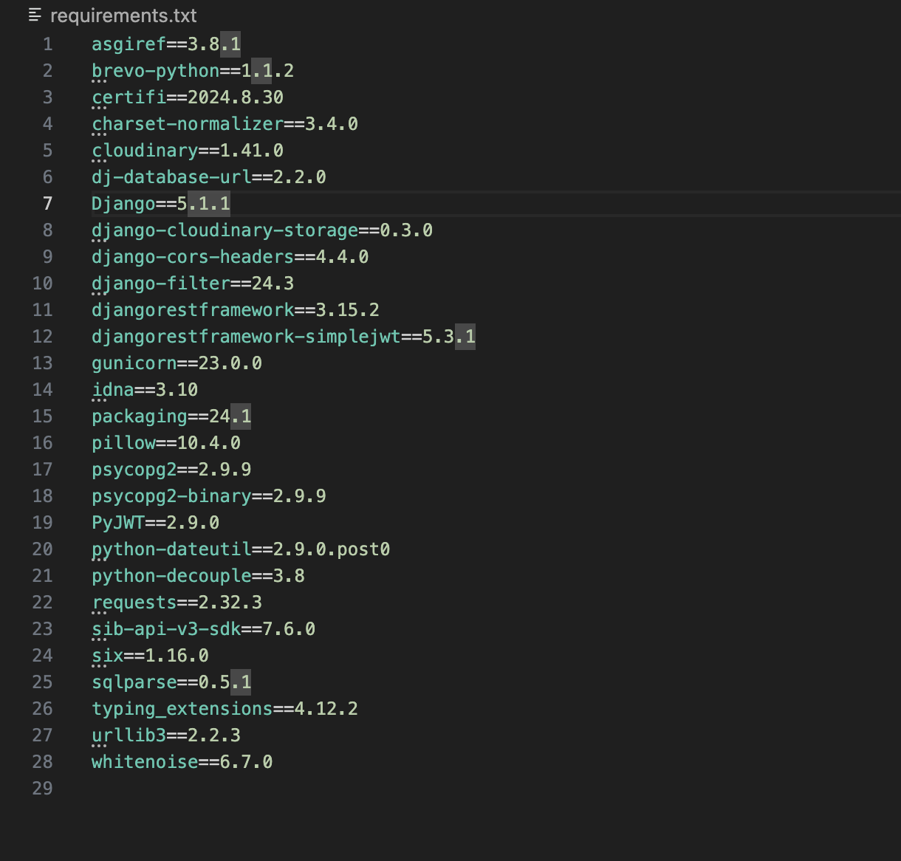

# Blog Project

# Overview

This repository contains the backend of the blog project built with Django REST Framework. It serves as the API for the frontend, providing functionalities such as user authentication, post creation, commenting, liking, following, and more.

- [Overview](#overview)
- [Features](#features)
- [Project Management](#project-management)
- [Technologies](#technologies)
- [Setup](#setup)
- [API Endpoints](#api-endpoints)
- [JWT Authentication](#jwt-authentication)
- [Testing](#testing)

[**Live Link**](https://frirsta-blog-frontend-bfdde69332c7.herokuapp.com/login)

[**Frontend Repository**](https://github.com/frirsta/blog_frontend)

# Features

### Authentication & Authorization

- JWT Authentication with Simple JWT.

- Login, Logout, and Token Refresh are implemented.

- Tokens are rotated and blacklisted after use for added security.

- The authentication backend uses case-insensitive login.

### User Profiles:

- **User Registration:** Users can create an account.

- **Profile Management:** Users can update their profile details, including profile picture, cover image, bio, website and location.

- **Account Deletion:** Users can delete their account.

- **Password Management:** Users can change or reset their password.

### Blog Posts:

- **Create, Read, Delete** functionalities for posts.

- Posts can have images, a title, text content, tags, and a category.

- Uploaded images are stored in Cloudinary through the Django backend.

### Comments and Likes:

- Users can like posts and view posts they have liked on their profile page.

- Users can comment on posts.

### Social Features:

- Users can follow/unfollow others and see followers and following lists.

# Project Management

I have used Github issues and Github project board for project management.

### Agile methodology

- **Must Have** - Are the issues that have to be top priority.
- **Should have** - Are second priority.
- **Could have** - Third priority.
- **Won't have** - Will not be in the project.

  The Won't have label is for long term use in the project and has not been




# Technologies

## Core Frameworks & Libraries

- Django
- Django Rest framework

## Database

- PostgreSQL

## Media Storage

- Cloudinary

## Email Services

- Brevo



# Setup

1. Clone the repository

2. Install backend dependencies:

- Set up a virtual environment:

  ```bash
  Source activate bin/local/myenv
  ```

- Install required Python packages:

  ```bash
   pip install -r requirements.txt
  ```

3. Install frontend dependencies:

   ```bash
   npm install
   ```

## Environment Variables

Create a .env file in the root directory with the following keys:

### Debug

- DEBUG=True

### Django secret key

- SECRET_KEY=your_secret_key

### Database URL

- DATABASE_URL=your_database_url

### Cloudinary configuration

- CLOUDINARY_CLOUD_NAME=your_cloud_name
- CLOUDINARY_API_KEY=your_api_key
- CLOUDINARY_API_SECRET=your_api_secret

### Email configuration (Brevo)

- EMAIL_HOST_USER=your_email
- EMAIL_HOST_PASSWORD=your_password
- DEFAULT_FROM_EMAIL=your_default_from_email

# API Endpoints

## Profiles API Endpoints

1. User Registration

   - URL: /profiles/register/
   - Method: POST

2. Profile List

   - URL: /profiles/
   - Method: GET

3. Profile Detail

   - URL: /profiles/<int:pk>/
   - Method: GET, PUT, DELETE

4. Password Reset

   - URL: /profiles/password-reset/
   - Method: POST

5. Password Reset Confirmation

   - URL: /profiles/password-reset-confirm/
   - Method: POST

6. Change Password

   - URL: /profiles/change-password/
   - Method: POST

7. Current User Profile

   - URL: /profiles/current/
   - Method: GET

### Posts API Endpoints

1. Post List & Create

   - URL: /posts/
   - Method: GET, POST

2. Post Detail

   - URL: /posts/<int:pk>/
   - Method: GET, PUT, DELETE

3. User's Posts

   - URL: /posts/user/<int:user_id>/
   - Method: GET

4. Category List

   - URL: /posts/category/
   - Method: GET

5. Tag List

   - URL: /posts/tags/
   - Method: GET

### Likes API Endpoints

1. List & Create Likes

   - URL: /likes/
   - Method: GET, POST

2. Like Detail & Delete

   - URL: /likes/<int:pk>/
   - Method: GET, DELETE

### Follows API Endpoints

1. Create Follow

   - URL: /follows/
   - Method: POST

2. Unfollow User

   - URL: /follows/<int:pk>/
   - Method: DELETE

### Comments API Endpoints

1. List and Create Comments

   - URL: /comments/
   - Method: GET and POST

2. Comment Detail, Update, and Delete

   - URL: /comments/<int:pk>/
   - Method: GET, PUT, PATCH, and DELETE

# JWT Authentication

The project uses JWT-based authentication to manage user sessions. This is implemented using Django REST Framework SimpleJWT, but with enhanced customizations to ensure security and proper user management.

### Key Customizations:

1. Custom JWT Authentication Class

- We use a custom CustomJWTAuthentication class that extends the default JWTAuthentication from SimpleJWT.
- This class checks if the user associated with the token is active before granting access.
- If a user account is disabled, a 403 Permission
- Denied error is returned with the message "User account is disabled."

2. Active User Check (IsActiveUser Permission)

- A custom permission class IsActiveUser has been added.
- This permission ensures that only active users can access the API endpoints protected by this permission.
- This provides an additional layer of protection, even if the user’s token is valid but the account has been deactivated.

#### Configuration

In settings.py, the authentication and permission classes have been updated as follows:

```python
 REST_FRAMEWORK = {

    'DEFAULT_AUTHENTICATION_CLASSES': (
        'blog.authentication.CustomJWTAuthentication',
    ),
    'DEFAULT_PERMISSION_CLASSES': (
        'blog.permissions.IsActiveUser',
    ),

}
```

##### Custom Classes

- CustomJWTAuthentication:
- Located in blog/authentication.py.
- Overrides get_user method to check if the user is active.

```python
from rest_framework_simplejwt.authentication import JWTAuthentication
from django.core.exceptions import PermissionDenied

class CustomJWTAuthentication(JWTAuthentication):
    def get_user(self, validated_token):
        user = super().get_user(validated_token)
        if not user.is_active:
            raise PermissionDenied("User account is disabled.")
        return user
```

##### IsActiveUser Permission:

- Located in blog/permissions.py.
- Ensures the request is made by an active user.

```python
from django.core.exceptions import PermissionDenied
from rest_framework.permissions import BasePermission

class IsActiveUser(BasePermission):
    def has_permission(self, request, view):
        if not request.user.is_active:
            raise PermissionDenied("User account is disabled.")
        return True
```

# Testing

### Testing the Enhanced Authentication Flow

This section verifies that the enhanced authentication system handles both active and inactive users correctly, and that the logout functionality behaves as expected.

#### Prerequisites:

- You must have a valid access token (`<your_access_token>`) and refresh token (`<your_refresh_token>`).

1. **Scenario 1: Active User Access:**

   - Verify that the user account is active (user.is_active = True).
   - Send a request to the protected endpoint:

     ```bash
     curl -X GET http://127.0.0.1:8000/current-user/ \
     -H "Authorization: Bearer <your_access_token>"
     ```

   - The response should return the user details as expected:

     ```json
     {
       "id": 11,
       "username": "testuser",
       "email": "",
       "profile_picture": "http://...",
       "cover_picture": "http://...",
       "bio": null,
       "location": null,
       "website": null,
       "first_name": "",
       "last_name": ""
     }
     ```

2. **Scenario 2: Inactive User Access:**

   - Mark the user account as inactive in the Django shell:

     ```python
     user = User.objects.get(username="testuser")
     user.is_active = False
     user.save()
     ```

   - Send the same request as above.
   - The response should indicate that the user is inactive:

     ```json
     {
       "detail": "User account is disabled.",
       "code": "user_inactive"
     }
     ```

3. **Scenario 3: Successful Logout:**

   - Ensure an active user can successfully log out:

     ```bash
     curl -X POST http://127.0.0.1:8000/logout/ \
     -H "Content-Type: application/json" \
     -H "Authorization: Bearer <your_access_token>" \
     -d '{"refresh": "<your_refresh_token>"}'
     ```

   - The response should confirm successful logout:

     ```json
     {
       "detail": "Successfully logged out."
     }
     ```

4. **Scenario 4: Logout Attempt by Inactive User:**

   - Try logging out with an inactive user’s refresh token:

     ```bash
     curl -X POST http://127.0.0.1:8000/logout/ \
     -H "Content-Type: application/json" \
     -H "Authorization: Bearer <your_access_token>" \
     -d '{"refresh": "<your_refresh_token>"}'
     ```

   - The response should indicate that the user account is disabled:

     ```json
     {
       "detail": "User account is disabled."
     }
     ```

> Note: If any unexpected issues occur during testing, ensure that the backend server is running, and the tokens are valid and not expired.
